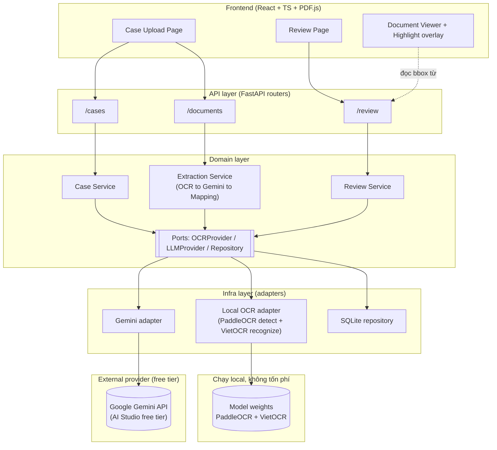

# ARCHITECTURE.md

> Dựa trên PROJECT_BRIEF.md (đã approved). Tài liệu này chốt kiến trúc kỹ thuật,
> không bàn lại phạm vi nghiệp vụ.

## 1. Tech Stack (đã chốt)

| Thành phần | Lựa chọn | Lý do ngắn gọn |
|---|---|---|
| Frontend | Vite + React + TypeScript + PDF.js | Vite cho dev/build đơn giản; React + TypeScript phù hợp Review UI; PDF.js render PDF và hỗ trợ overlay highlight theo bbox. |
| Backend | Python + FastAPI + Pydantic | Đúng đề xuất ban đầu. Pydantic giúp validate dữ liệu OCR/LLM (vốn có schema phức tạp: block, bbox, field, source_id) một cách chặt chẽ. |
| Database / persistence | SQLite + SQLAlchemy 2.x | SQLite phù hợp MVP local; SQLAlchemy 2.x giúp schema/repository rõ ràng và dễ chuyển sang PostgreSQL sau này mà không đổi domain logic. |
| OCR provider | **Tự host, miễn phí: PaddleOCR (text detection) + VietOCR (nhận dạng tiếng Việt) + local template OMR cho checkbox** | PaddleOCR (mã nguồn mở, Apache 2.0) tìm vùng chữ và trả về bounding box + confidence; VietOCR (`pbcquoc/vietocr`) nhận dạng tiếng Việt trên từng vùng đã detect. Checkbox trên biểu mẫu cố định được đọc bằng OpenCV template OMR trong cùng local adapter, không giao cho OCR text hoặc Gemini suy đoán. Cả ba bước chạy local. **Rủi ro cần thử nghiệm sớm:** không giả định chất lượng chữ viết tay/ảnh chụp sẽ đạt yêu cầu; phải benchmark trên dữ liệu synthetic đại diện và fail closed khi confidence không đạt. |
| LLM provider | **Google Gemini API (Google AI Studio, free tier)** | Hỗ trợ tiếng Việt và structured output theo schema. Free-tier quota có thể thay đổi nên code phải xử lý rate-limit/retry có giới hạn; chỉ dùng dữ liệu synthetic cho demo. |

Không đổi frontend/backend/DB so với đề xuất ban đầu vì đã hợp lý với quy mô MVP.
Phần OCR/LLM chốt theo hướng **chi phí thấp cho demo**: OCR chạy local bằng mã nguồn mở,
LLM dùng free tier của Google AI Studio. Quota/chính sách free tier có thể thay đổi, vì vậy
không hard-code giả định quota vào business logic.

**Tooling đã chốt:** frontend scaffold bằng Vite; frontend test runner dùng Vitest; backend lint/test/typecheck dùng Ruff + Pytest + mypy. Không để coding agent tự chọn lại các công cụ này trong lúc implement.

## 2. Kiến trúc tổng thể

**Modular Monolith** — một backend FastAPI duy nhất, chạy một process, nhưng được
chia thành các module có ranh giới rõ ràng (case, document, extraction, review).
Không tách microservices.

Lý do: khối lượng xử lý ở MVP nhỏ (vài hồ sơ để demo), tách microservices ở giai
đoạn này chỉ tạo thêm chi phí vận hành (network, deploy, đồng bộ dữ liệu) mà không
mang lại lợi ích tương xứng. Việc tổ chức module rõ ràng ngay từ đầu vẫn cho phép
tách thành service riêng sau này nếu thực sự cần, mà không phải viết lại từ đầu.

Nguyên tắc thiết kế: **Ports & Adapters** (hay còn gọi là Hexagonal Architecture) ở
mức tối giản — tầng domain (business logic) không gọi trực tiếp PaddleOCR/VietOCR, Google Gemini
hay SQLAlchemy, mà gọi qua các **interface (port)** trừu tượng. Phần code cụ thể
gọi OCR/LLM/SQLite nằm ở tầng infra, đóng vai trò adapter implement các port đó.

Lý do chọn cách này dù MVP chỉ có 1 OCR/1 LLM provider: đây chính là cách để về sau
"provider tách khỏi domain" (một nguyên tắc sẽ ghi trong DEVELOPMENT_RULES.md) —
nếu sau MVP cần đổi OCR/LLM provider, chỉ cần viết adapter mới, không phải sửa business logic.

## 3. Component Boundaries

**Backend** chia thành 3 tầng:

1. **API layer** (`api/`) — các router FastAPI. Chỉ nhận request, gọi service tương
   ứng, trả response. Không chứa business logic.
2. **Domain layer** (`domain/`) — business logic thuần, không phụ thuộc framework
   hay provider cụ thể:
   - **Case Service** — quản lý vòng đời hồ sơ (tạo case, gắn document).
   - **Extraction Service** — điều phối luồng OCR → LLM extract → mapping
     source_id thành bounding box. Đây là "nhạc trưởng" của pipeline xử lý.
   - **Review Service** — đọc dữ liệu field cho Review UI, nhận sửa từ chuyên
     viên, xử lý hành động Upload (lưu toàn bộ hồ sơ một lần).
   - **Ports** (`domain/ports/`) — interface trừu tượng: `OCRProvider`,
     `LLMProvider`, `Repository` (không có code cụ thể, chỉ định nghĩa "hợp đồng").
3. **Infra layer** (`infra/`) — implement các port ở trên:
   - Adapter chạy PaddleOCR + VietOCR và local template OMR, convert text và
     checkbox selection thành OCRBlock nội bộ có phân loại rõ ràng.
   - Adapter gọi Google Gemini, convert response thành dữ liệu extraction nội bộ.
   - Repository dùng SQLAlchemy 2.x để đọc/ghi SQLite cho Case, Document, OCRBlock, ExtractedField,
     FieldSource, ReviewAction.

**Frontend** chia thành:
- **Case/Upload page** — tạo hồ sơ, upload 4 loại giấy tờ.
- **Document Viewer** — wrapper quanh PDF.js, render trang tài liệu, vẽ overlay
  highlight theo bounding box.
- **Review Panel** — danh sách field, cho sửa giá trị, click field để đồng bộ
  Document Viewer (mở đúng document/trang, highlight đúng vùng).
- **Upload action** — nút lưu toàn bộ dữ liệu hồ sơ một lần (theo PROJECT_BRIEF đã
  chốt: không confirm từng field riêng lẻ).

## 4. Dependency Direction

- `api/` → phụ thuộc `domain/` (gọi service).
- `domain/` → chỉ phụ thuộc `domain/ports/` (interface), **không** import trực
  tiếp PaddleOCR/VietOCR, Google Gemini SDK, hay SQLAlchemy.
- `infra/` → phụ thuộc `domain/ports/` (implement interface) và các SDK bên ngoài.
- Frontend → chỉ giao tiếp với backend qua REST API, không truy cập DB trực tiếp.

Chiều phụ thuộc luôn đi **vào trong** (infra → domain), domain không bao giờ biết
tới chi tiết kỹ thuật của infra. Đây là nguyên tắc quan trọng nhất của kiến trúc
này — vi phạm nó (ví dụ domain gọi thẳng SDK Google) sẽ phá vỡ khả năng thay
provider sau này.

## 5. Folder Structure (đề xuất)

```
project-root/
├── AGENTS.md                     # Instruction ngắn cho Codex, đặt ở repository root
├── backend/
│   ├── app/
│   │   ├── api/                  # FastAPI routers (thin)
│   │   │   ├── cases.py
│   │   │   ├── documents.py
│   │   │   └── review.py
│   │   ├── domain/                # Business logic, framework-agnostic
│   │   │   ├── models.py          # Case, Document, OCRBlock, ExtractedField, FieldSource, ReviewAction
│   │   │   ├── services/
│   │   │   │   ├── case_service.py
│   │   │   │   ├── extraction_service.py
│   │   │   │   └── review_service.py
│   │   │   └── ports/              # Interfaces (không có logic cụ thể)
│   │   │       ├── ocr_provider.py
│   │   │       ├── llm_provider.py
│   │   │       └── repository.py
│   │   ├── infra/                  # Adapter cụ thể, implement ports/
│   │   │   ├── ocr/
│   │   │   │   └── local_ocr_adapter.py   # PaddleOCR (detect) + VietOCR (recognize)
│   │   │   ├── llm/
│   │   │   │   └── gemini_extractor.py    # Google Gemini API (free tier)
│   │   │   └── db/
│   │   │       ├── sqlite_repository.py
│   │   │       └── orm_models.py
│   │   └── main.py                 # Khởi tạo app, wiring dependency injection
│   └── tests/
├── frontend/
│   └── src/
│       ├── pages/
│       │   ├── CaseUploadPage.tsx
│       │   └── ReviewPage.tsx
│       ├── components/
│       │   ├── DocumentViewer/
│       │   ├── FieldList/
│       │   └── FieldItem/
│       ├── api/                    # Gọi REST API backend
│       └── types/                  # TypeScript type khớp schema backend
└── docs/
    ├── PROJECT_BRIEF.md
    ├── ARCHITECTURE.md
    ├── DATA_MODEL.md
    ├── DEVELOPMENT_RULES.md
    ├── ROADMAP.md
    └── FEATURE_BACKLOG.md
```

## 6. Giải thích chi tiết các module chính

- **OCR Module** (`infra/ocr/`, implement `OCRProvider`) — nhận file ảnh/PDF của
  một document kèm `document_type` và chạy local: (1) PaddleOCR detection tìm
  vùng chữ và toạ độ;
  (2) VietOCR nhận dạng nội dung tiếng Việt trong từng vùng; (3) với
  `LOAN_APPLICATION` thuộc template đã đăng ký, template OMR căn chỉnh trang và
  phân loại checkbox. Kết quả text và checkbox selection đều trở thành
  `OCRBlock` nội bộ có `block_kind`, page, bbox chuẩn hoá, confidence và
  source_id do hệ thống tự sinh. OMR hỗ trợ template V1 không marker bằng
  feature matching/homography và V2 có marker ID ở bốn góc; cả hai đều tinh
  chỉnh checkbox trong ROI cục bộ và fail closed nếu không đủ chắc chắn. Vì
  chạy local, module cần model weights PaddleOCR/VietOCR sẵn trên máy và không
  gọi network khi xử lý. Đây là **nguồn sự thật duy nhất** cho mọi bounding box
  trong hệ thống — LLM và các module khác không được tự tạo bbox.

  `OCRProvider.extract` nhận `document_id`, `document_type` và `file_path`.
  `document_type` là metadata orchestration đã có, cần thiết để adapter chỉ bật
  template OMR cho `LOAN_APPLICATION`; adapter không được đoán loại tài liệu từ
  tên file.

- **LLM Extraction Module** (`infra/llm/gemini_extractor.py`, implement
  `LLMProvider`) — nhận danh sách document input, mỗi document gồm
  `document_id`, `document_type` và các OCRBlock (text/checkbox selection +
  source_id), gọi model `gemini-3.7-flash` qua SDK `google-genai==2.21.0` với
  schema JSON đã định nghĩa sẵn
  (field_code, value, source_ids), và validate kết quả trả về bằng Pydantic. Model
  chỉ được chọn source_id có sẵn trong input, không được tự sinh toạ độ hay
  source_id mới. Field không tìm thấy dùng `value = null, source_ids = []`; field có value phải có ít nhất một source_id hợp lệ. Validate nghiêm trước khi lưu. Vì đây là API free tier có giới hạn request/phút, module này nên có cơ chế
  retry/backoff đơn giản khi bị rate-limit (chi tiết cụ thể sẽ nằm trong
  DEVELOPMENT_RULES.md / khi code, không bàn sâu ở đây).

- **Mapping (nằm trong Extraction Service)** — sau khi có `source_ids` từ LLM,
  tra ngược lại `OCRBlock` tương ứng (đã lưu ở bước OCR) để lấy bounding box thật.
  Việc này nằm ở tầng domain (`extraction_service.py`), không nằm trong infra,
  vì đây là business logic, không phải chi tiết kỹ thuật của provider.

- **Review Module** (`review_service.py` + Review Panel/Document Viewer ở
  frontend) — cung cấp dữ liệu field kèm vị trí bbox cho frontend hiển thị, nhận
  chỉnh sửa giá trị field từ chuyên viên, và xử lý hành động Upload (lưu toàn bộ
  dữ liệu hồ sơ vào SQLite trong một lần, theo đúng PROJECT_BRIEF).

## 7. Luồng xử lý & Diagram



Luồng dữ liệu theo đúng PROJECT_BRIEF: Upload → OCR (PaddleOCR + VietOCR chạy
local, qua `ExtractSvc`) → lưu `OCRBlock` → gọi LLM (Gemini) → nhận field +
source_ids → map sang bbox → lưu `ExtractedField` + `FieldSource` → Review UI đọc
dữ liệu này để hiển thị và cho sửa → chuyên viên bấm Upload → `ReviewSvc` lưu kết
quả cuối.

## 8. Xử lý bất đồng bộ ở MVP (không dùng queue)

Sau khi upload đủ giấy tờ, việc chạy OCR + gọi LLM có thể mất vài giây đến vài
chục giây — không nên chặn (block) request upload cho tới khi xong hết.

**Quyết định:** dùng `BackgroundTasks` sẵn có của FastAPI để chạy pipeline
OCR → LLM ngầm sau khi nhận đủ document, kèm một trường trạng thái đơn giản trên
Case (ví dụ: `uploaded` → `processing` → `ready`) để frontend polling và biết khi
nào có thể chuyển sang Review Page.

Lý do không dùng hàng đợi thật (Celery/RabbitMQ/Redis...): đúng như PROJECT_BRIEF
đã loại khỏi MVP ("queue phức tạp"). Với quy mô demo vài hồ sơ, chạy nền trong
cùng process là đủ, không cần thêm hạ tầng. Việc này càng hợp lý hơn vì OCR giờ
chạy local trên CPU (PaddleOCR + VietOCR) — có thể mất vài giây tới hơn chục giây
mỗi tài liệu, nên tuyệt đối không nên chặn request upload. Nếu sau này khối lượng
hồ sơ tăng lên nhiều, đây là điểm có thể nâng cấp mà không phải đổi kiến trúc
domain (vì `ExtractSvc` không quan tâm nó được gọi từ BackgroundTasks hay từ
worker của queue thật).

## 9. Những gì KHÔNG xây trong MVP (kiến trúc)

- Không tách microservices — chỉ 1 backend FastAPI duy nhất.
- Không dùng message queue/broker (Celery, RabbitMQ, Redis, Kafka...).
- Không có hệ thống authentication/authorization — MVP giả định một người dùng
  ngầm định, chưa cần đăng nhập/phân quyền.
- Không dùng cloud storage (S3...) cho file upload — lưu file trên local disk,
  đường dẫn lưu trong SQLite.
- Không hỗ trợ nhiều OCR/LLM provider cùng lúc — dù có tầng `ports/` để dễ đổi
  sau này, MVP chỉ implement đúng 1 adapter mỗi loại.
- Không có containerization/orchestration (Docker Compose, Kubernetes...) bắt
  buộc cho MVP — có thể thêm sau nếu cần, không ảnh hưởng kiến trúc code.
- Không có real-time update qua WebSocket — trạng thái xử lý dùng polling đơn
  giản là đủ.
- Không bắt buộc có GPU — PaddleOCR/VietOCR chạy CPU vẫn dùng được cho quy mô demo
  vài hồ sơ (chỉ chậm hơn chạy GPU). Không cần tạo billing account/khai báo thẻ
  tín dụng ở bất kỳ đâu trong MVP.

---

- Last updated: <để tôi tự điền ngày>
- Downstream docs cần rà lại nếu file này đổi: DATA_MODEL.md, DEVELOPMENT_RULES.md,
  AGENTS.md, ROADMAP.md, FEATURE_BACKLOG.md
